INTRODUCTION
These exercises focused on investigating Linux authentication mechanisms and implementing secure user and access management in a DevSecOps environment. The tasks required identifying how the system stores password data, configuring department-based access control, enforcing least privilege, and validating all changes through direct system evidence.
I used Kali Linux deployed within an Oracle VirtualBox virtual machine to perform the practical tasks in this assignment.
SUMMARY OF THE TASKS
Scenario 1: Password State Investigation & Remediation
Context
During a routine security audit, the Security Director asks you:
“Show me how you identify users on this system who do not have passwords set, and then demonstrate how you would remediate one.”
You are not told where Linux stores password state. You are expected to discover it, inspect it, and explain your reasoning.

Part A: Create a User with No Password
To list all users, I ran the following command; cat /etc/passwd
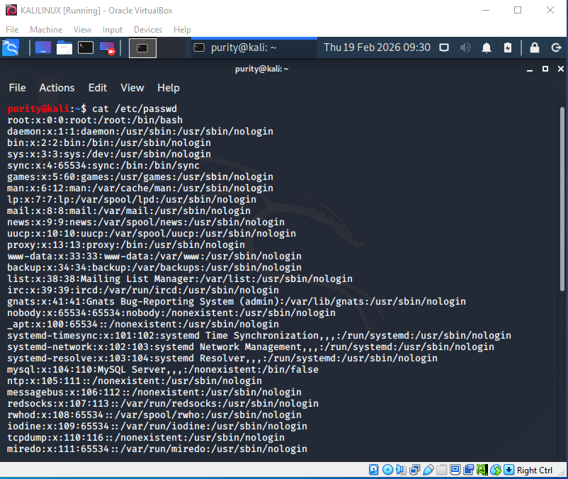 

1.	Create a new user called audit_test
2.	Ensure the user is created without setting a password
I created a new user named audit_test using the useradd command. useradd creates a user with no password by default.
The account was successfully created, and no prompt was given to set a password
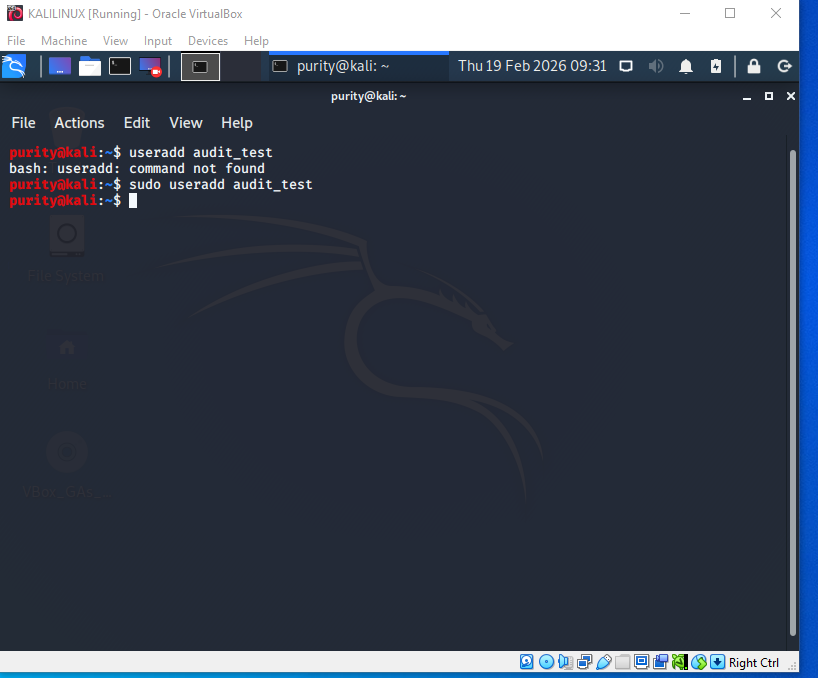

3. Confirm that the user exists on the system
To confirm the user exists I ran the cat /etc/passwd command
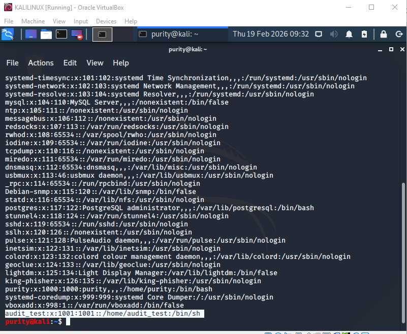 

Security / System Implications
An account without a password may not allow password-based login, but it still represents a potential security risk depending on authentication configuration (e.g., SSH key access, misconfigured PAM rules). Accounts without proper password controls should always be reviewed.

Part B: Identify Users Without Passwords (Discovery Required)
1.	Inspect the system location that stores password state
I inspected the /etc/shadow file:
sudo cat /etc/shadow
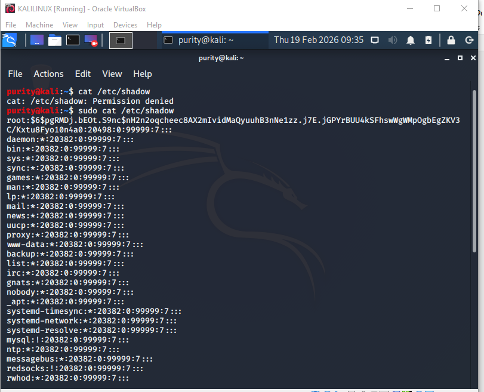

2.	Identify which users do not have an active password
3.	Clearly indicate how you know the password is missing or inactive Discovery Process

I examined /etc/shadow, which stores encrypted password hashes and password state information.
The second field in /etc/shadow represents the password hash.
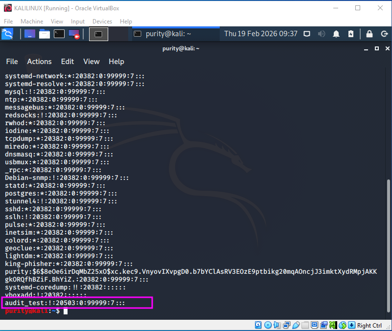

 
For audit_test, the field contains:
!
This indicates the account has no valid password set (locked or inactive password field).
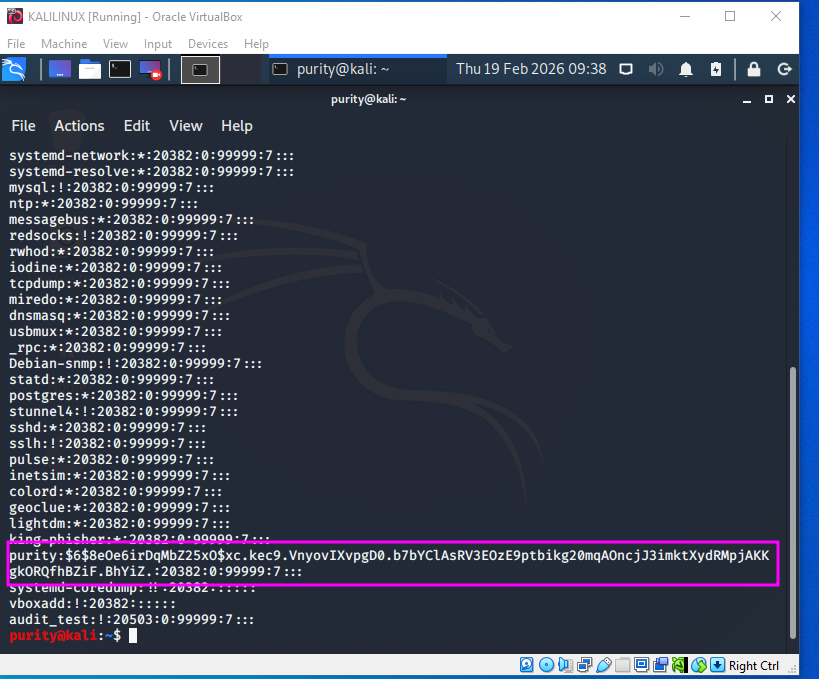

 
For purity, the field contains a password hash meaning it has a password
Security / System Implications
The /etc/shadow file is highly sensitive. It is permission-restricted because it contains password hashes. If readable by non-privileged users, it would present a serious security risk. Proper file permissions protect against offline password cracking attempts.

Part C: Remediation – Setting a Password
Password-Setting Command
sudo passwd audit_test
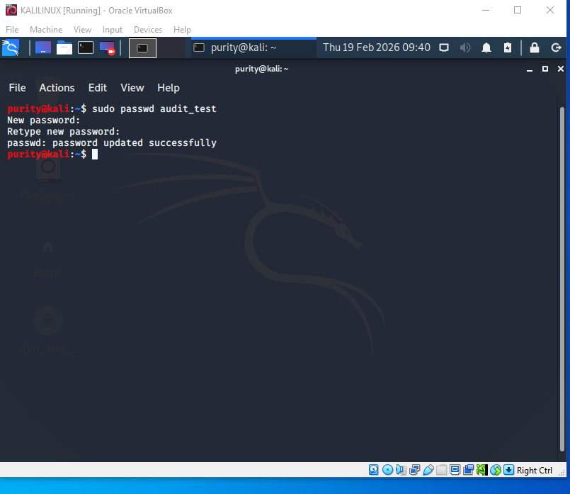

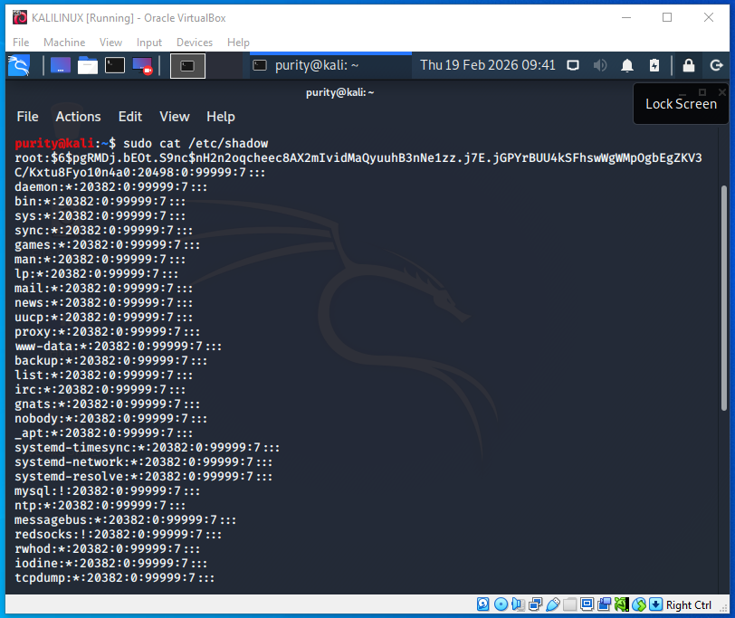 
 
To verify I ran:
sudo cat /etc/shadow 
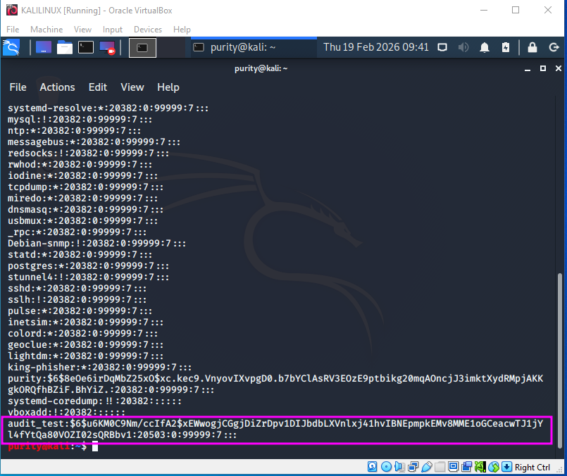
 
The ! was replaced by a long hashed value.

Security / System Implications
The presence of a hashed password confirms that the account can now authenticate using password-based login (depending on system configuration). The hashing algorithm ensures that even if /etc/shadow is compromised, plaintext passwords are not directly exposed.

Demonstrate, using the terminal, whether a normal (non-privileged) user can access the system location where password data is stored, and arrive at a conclusion based on your observation.
 

To test access permissions:
I ran the command whoami to verify that I’m a normal user (purity)
Then ran the command cat /etc/shadow (should fail)
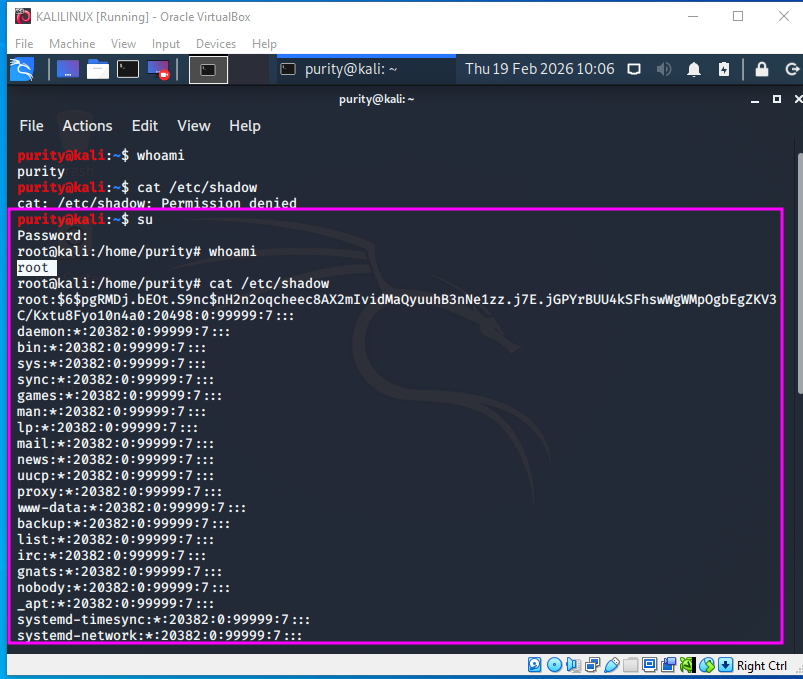
 
After switching user to root, I was able to view the /etc/shadow
Observation.
/etc/passwd is readable by normal users
/etc/shadow is not readable by normal users, permission denied for normal users
A normal (non-privileged) users cannot access password data stored in /etc/shadow.

Scenario 2: DevSecOps User & Department Access Configuration
You are a DevSecOps Engineer responsible for onboarding new staff onto a Linux server used for application development, security monitoring, QA, and CI/CD operations. Company policy enforces department-based access control, least privilege, and audit traceability.
Newly On boarded Staff
● lateef
● purity
● arthur
● paula
● yaa
● alex
● habiba
● aminat
Department Groups
● dev_team – Application Developers
● sec_team – Security & SOC
● qa_team – Quality Assurance
● ops_team – Operations & Infrastructure
Service Account
● ci_runner – CI/CD automation (non-login account)

Tasks
1.	Create all on boarded users using a mix of user management commands.

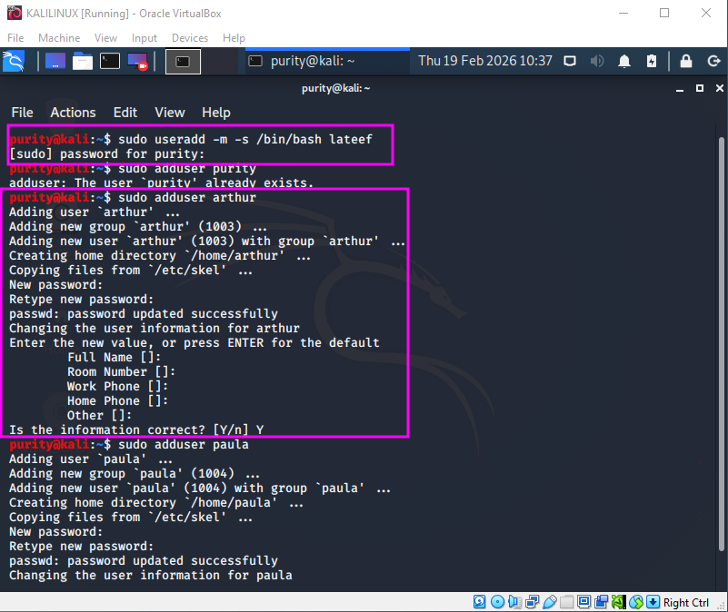
 
I used useradd -m -s /bin/bash lateef to manually create the user lateef, where:
•	-m created the home directory.
•	-s /bin/bash assigned Bash as the default login shell.

 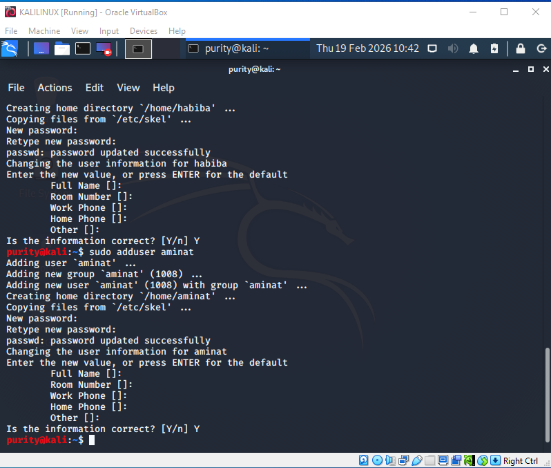
I used the adduser command to create other users such as arthur and paula. This command:
•	Automatically created their home directories.
•	Prompted me to set passwords.
•	Allowed me to configure additional user information.
•	Created a corresponding primary group for each user.

 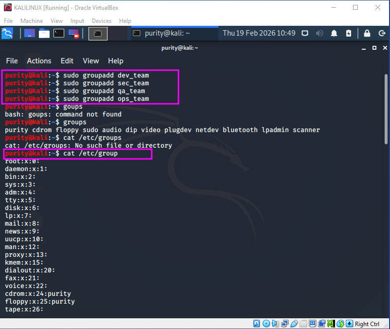

I created four department groups using the command sudo groupadd and verified their creation using the command cat /etc/group
 
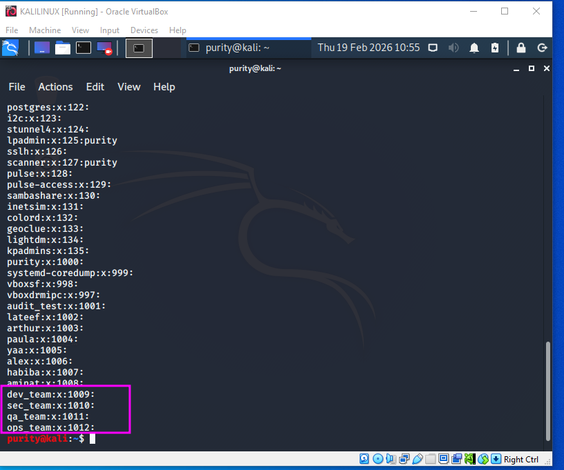

2. Assign users to departments as follows:
○ lateef, arthur → dev_team
○ purity, habiba → sec_team
○ paula, yaa → qa_team
○ alex, aminat → ops_team
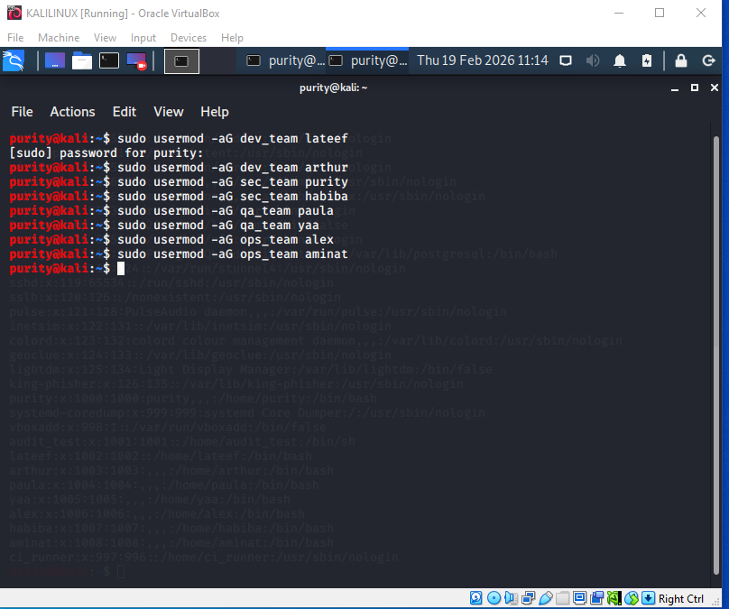
 
I assigned users strictly according to their departments:
•	dev_team → lateef, arthur
•	sec_team → purity, habiba
•	qa_team → paula, yaa
•	ops_team → alex, aminat

This ensures that each user only has access to resources relevant to their assigned department. This structure supports proper access control and audit traceability within the system.
 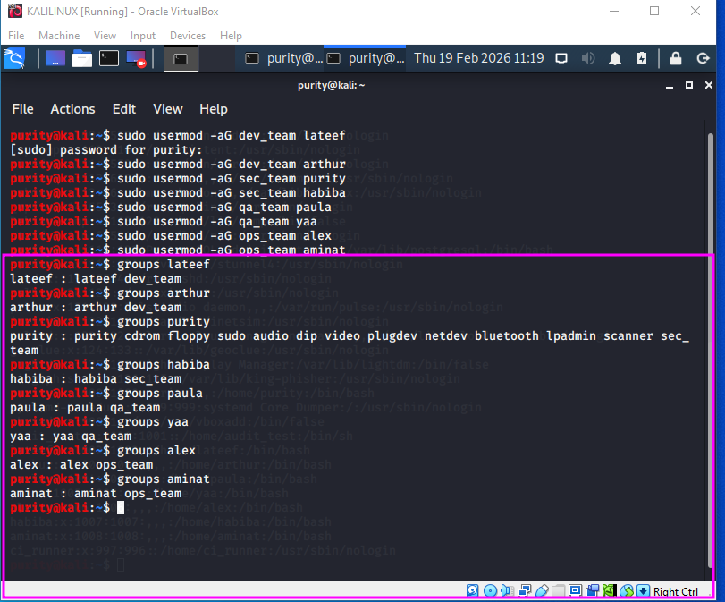

After assigning users to their respective departments, I verified group membership using the groups username command.
The command output displayed the primary and supplementary groups associated with each user, confirming that the system correctly recognized and stored the group memberships.

3. Ensure one user is created without a password, then later set the password and
confirm the change.
useradd does not set passwords.
I used useradd -m -s /bin/bash lateef to manually create the user lateef, where:
•	-m created the home directory.
•	-s /bin/bash assigned Bash as the default login shell.

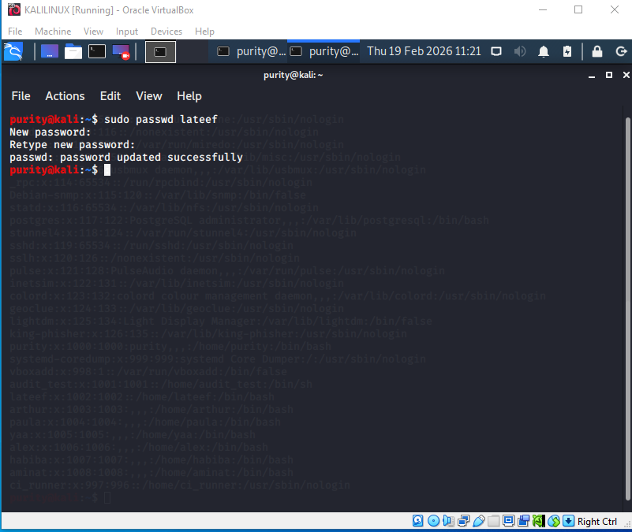
 
The account existed but did not have an active password.
To remediate this, I used the command: sudo passwd lateef

4.	Configure the ci_runner account with a non-login shell.
 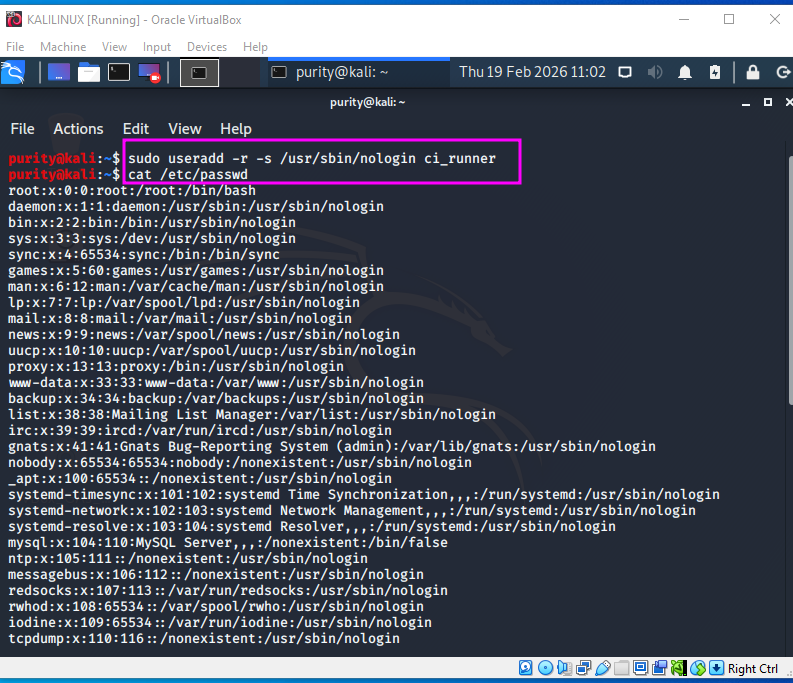

I created the ci_runner service account using the command:
sudo useradd -r -s /usr/sbin/nologin ci_runner
•	-r created the account as a system account (used for services, not regular users).
•	-s /usr/sbin/nologin assigned a non-login shell, preventing interactive access.
This ensures the account is strictly used for automated CI/CD processes and cannot be used to log into the system manually.

 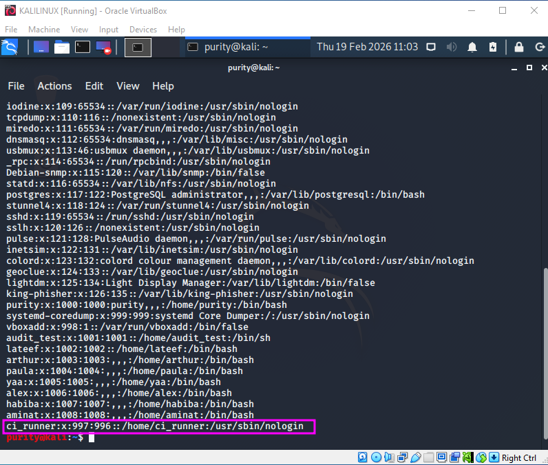
To verify the configuration, I ran:
cat /etc/passwd
From the output, I confirmed that: the ci_runner account exists.

5. Grant sudo access to one user from ops_team only; all other users must remain
     within their department privileges.
	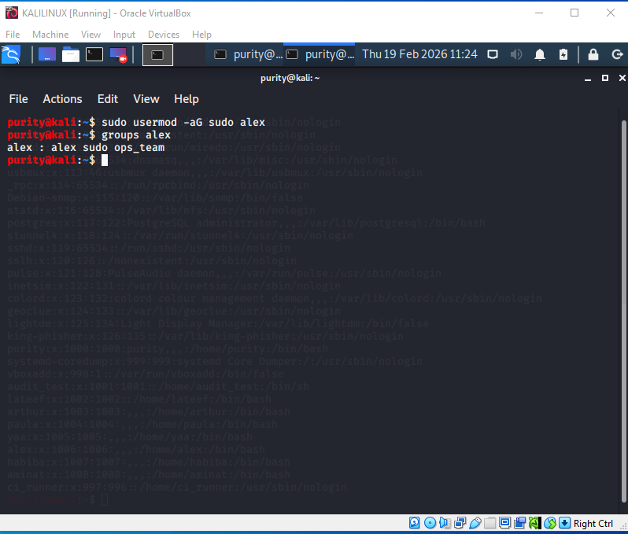 

I granted sudo privileges to only one user from the ops_team group- alex by adding him to the sudo group. All other users in the system do not have sudo access and are restricted.
To verify that alex has sudo privileges, I checked his group membership using the command:
groups alex
The output showed that alex is a member of the sudo group which grants administrative privileges. Being part of the sudo group means alex can execute commands with elevated privileges using sudo, while other users without this group membership cannot.

6. Remove one user account while preserving the home directory for audit and security
reasons.
 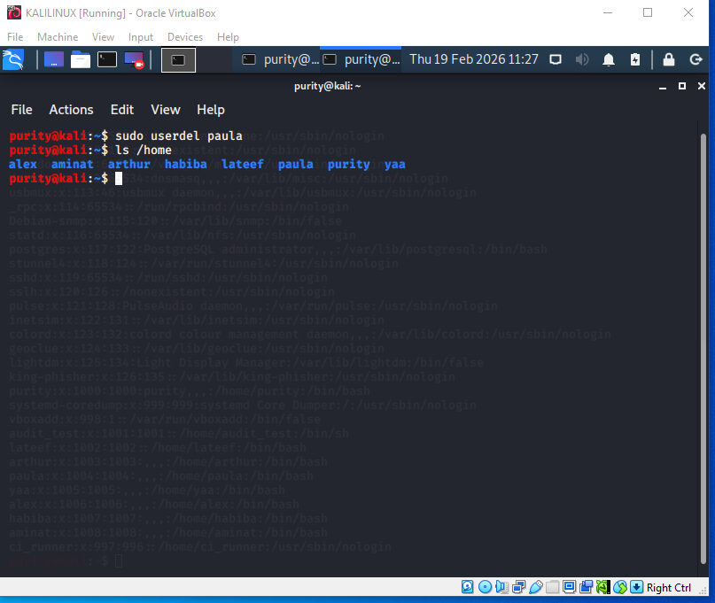

I removed the user paula from the system using the command: sudo userdel paula. 
sudo userdel -r paula removes home directory
I verified home directory for paula still exists using ls /home command. 
The home directory /home/paula remained intact, preserving files and configuration for audit or forensic purposes.

7. Verify and demonstrate that:
○ Department group membership is correctly assigned
 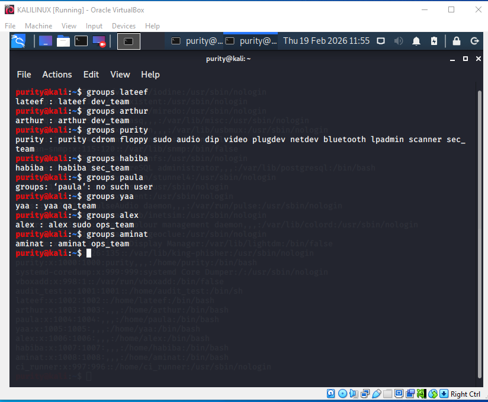

I used the groups command to verify that each user was correctly mapped to their specific department.
The command groups paula confirms the removal of a user (Task 6), as the command groups paula returns no such user, proving the account was successfully deleted while the system remains clean.

○ Group data is recorded and retrievable from the system
 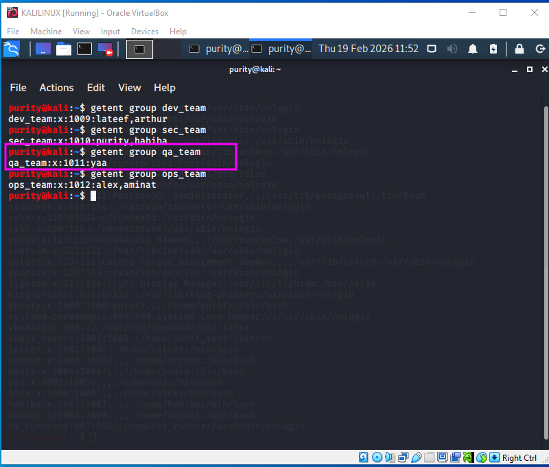

I ran the command getent group [group_name] for every team (dev_team, sec_team, qa_team, and ops_team) to verify that the departments have been recorded.
The command getent group qa_team also verifies the removal of paula.
Even though the initial onboarding instructions required both paula and yaa to be members of this group, only yaa is listed. Because I ran the command to delete the account, the Linux system automatically updated the group database to strip her name from the member list. The absence of her name here, combined with the "no such user" error I received when I ran the command groups paula, provides the necessary audit trail to show that the account is no longer active on the server.

○ User privilege boundaries are enforced
To verify that the access controls were working in a real-world scenario, I simulated the login session for different users to test their specific permissions.
 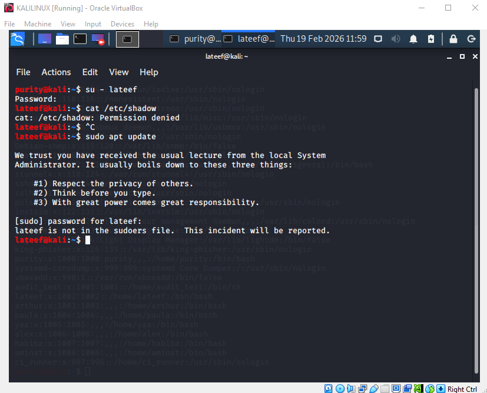

I ran the command su - lateef to switch from my administrative account to Lateef’s profile. Once identified as a normal user in the dev_team, I attempted to perform an administrative task.
I ran the command sudo apt update, and as shown in the screenshot, the system correctly denied the request with the warning: “lateef is not in the sudoers file. This incident will be reported.” This confirms that Lateef is a less-privileged user.
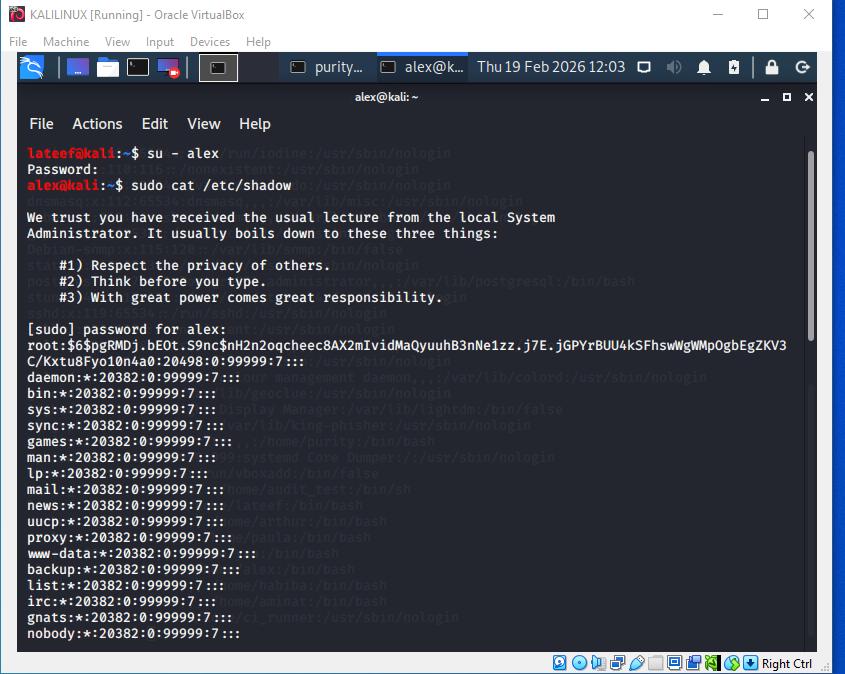

 
Since user alex was granted sudo access, he successfully executes sudo cat /etc/shadow and sudo apt update commands. The system displays the contents of the sensitive file, confirming that alex has the necessary elevated privileges to perform infrastructure and operations tasks that other users like lateef cannot.
This demonstrated that the system correctly distinguishes between a "normal" user and an "authorized" administrator, ensuring that only the right people have the right level of access.
CONCLUSION
The activities demonstrated practical control over Linux user lifecycle management, password auditing, group-based access enforcement, and privilege restriction. They reinforced the importance of proper access boundaries, secure configuration of service accounts, controlled privilege escalation, and maintaining audit traceability to support a secure and well-governed system environment.
